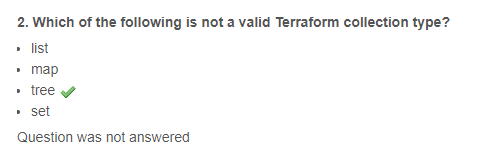
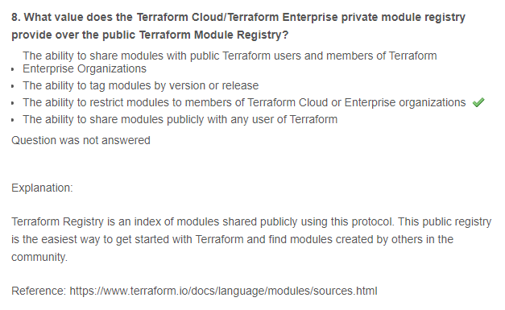
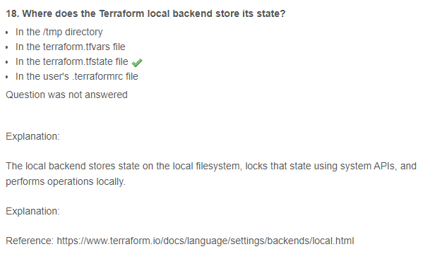
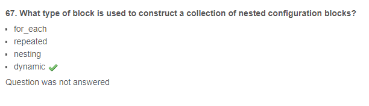

# HashiCorp Certified Terraform Associate Practice Exam

## Description

HashiCorp Associate Certification exams consists of multiple choice, multiple answer, true/false, and other question types. Below are some examples so you can familiarize yourself with the exam format. None of the questions on HashiCorp exams are intended to trick you. We want to test your knowledge of Terraform, not how well you spell or how good you are at identifying obscure details.

## Examples

### Disclaimer

While every effort has been made to ensure accuracy, some answers may be incorrect. Please conduct your own research to verify the information. Additionally, the questions provided do not represent actual exam questions. This document is intended solely for testing your knowledge and enhancing your practice.

## Contributing

If you would like to contribute to this repository, please follow the steps below:

1. Fork the repository
2. Create a new branch
3. Make your changes
4. Submit a pull request
5. Wait for the pull request to be reviewed and merged
6. :tada: Celebrate! :tada:

## Resources

- [Sample Questions - Terraform Associate Certification](https://learn.hashicorp.com/tutorials/terraform/associate-questions)

- [Study Guide - Terraform Associate Certification](https://learn.hashicorp.com/tutorials/terraform/associate-study?in=terraform/certification)

- [Exam Review - Terraform Associate Certification](https://learn.hashicorp.com/tutorials/terraform/associate-review?in=terraform/certification)
